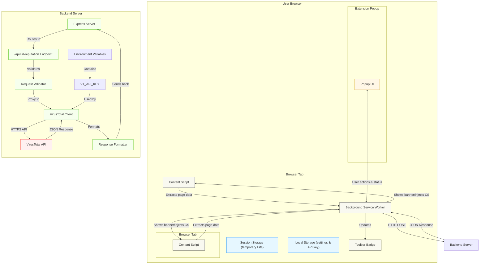

# Architecture Diagram

## Component Descriptions

### Client-Side Components
- **Content Scripts**: Injected into web pages to gather textual content and links for analysis
- **Background Service Worker**: Central orchestrator that manages the analysis pipeline, state, and communication
- **Extension Popup**: User interface for manual controls, settings, and detailed scan results
- **Toolbar Badge**: Visual indicator in browser toolbar showing current tab security status
- **Session Storage**: Browser storage for temporary trust/blocklists (cleared on browser exit)
- **Local Storage**: Browser storage for persistent settings like API key and preferences

### Server-Side Components
- **Express Server**: Node.js web framework handling HTTP requests
- **API Endpoint**: RESTful interface (`/api/url-reputation`) for URL reputation checking
- **Request Validator**: Validates incoming requests (URL format, required parameters)
- **VirusTotal Client**: Handles secure communication with VirusTotal API using server-side API key
- **Response Formatter**: Transforms VirusTotal responses into consistent format for extension
- **Environment Variables**: Secure storage for sensitive configuration like API keys

### External Service
- **VirusTotal API**: Industry-standard threat intelligence platform aggregating results from 70+ security engines

## Data Flow
1. **Collection**: Content scripts extract page information and send to background worker
2. **Local Analysis**: Background worker runs immediate heuristic analysis on collected data
3. **Cloud Check**: Background worker asynchronously queries backend for reputation check
4. **Backend Processing**: Server securely forwards request to VirusTotal using server-side API key
5. **Result Fusion**: Background worker combines local and remote results using priority logic
6. **User Feedback**: Background worker updates toolbar icon and triggers banner display via content scripts
7. **Session Tracking**: Security decisions recorded in session storage for history and statistics
