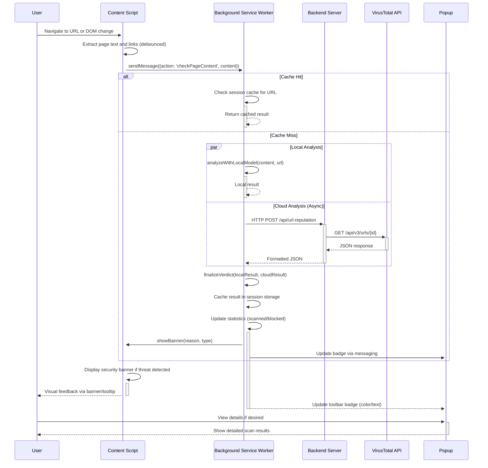
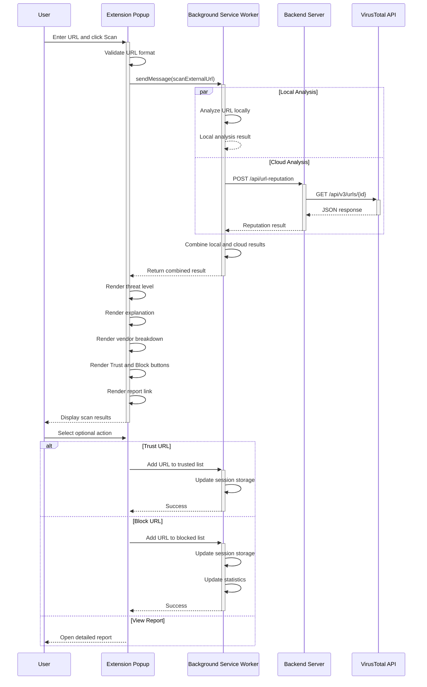
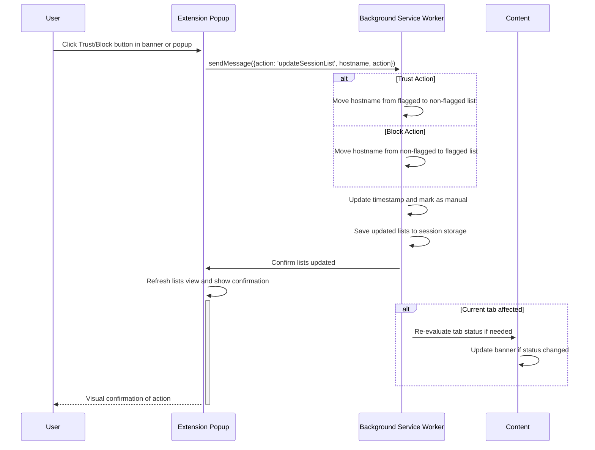
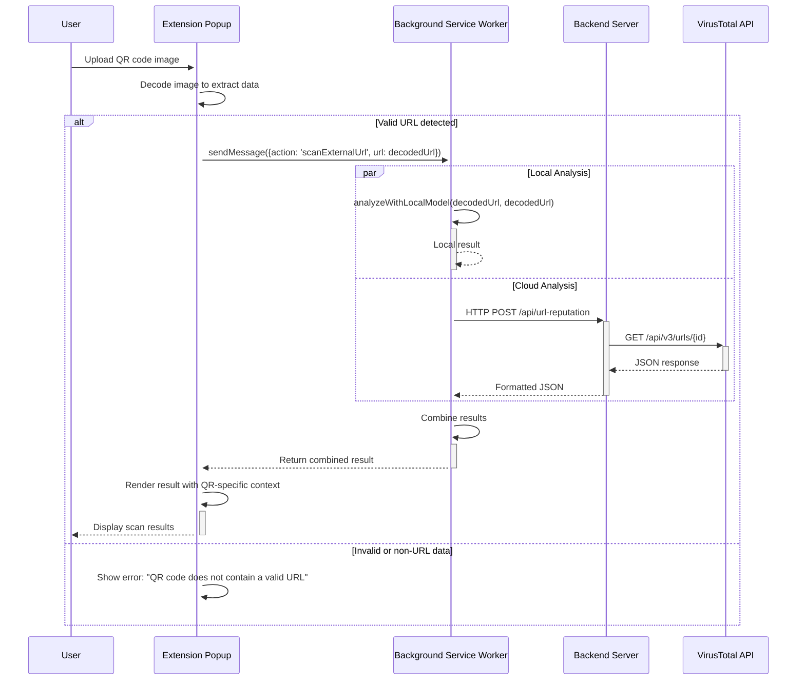
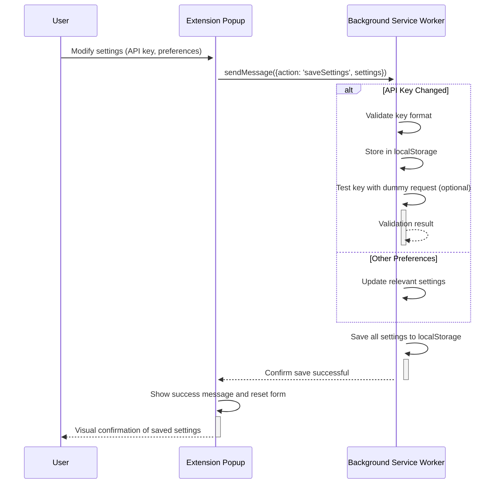
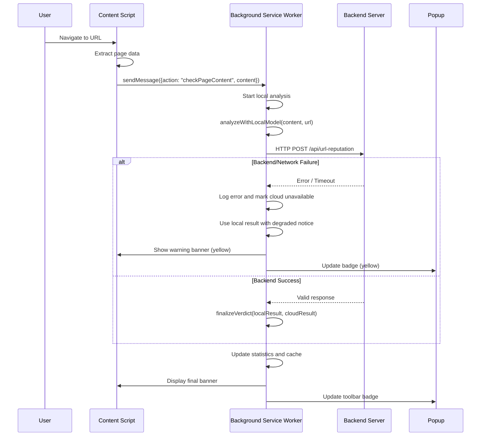

# Workflow

## Overview
This document illustrates key workflows in the AI Phishing Defense system using Mermaid sequence diagrams.

## 1. Automatic Page Scan Workflow
*Triggered when user navigates to a new page or significant DOM changes occur*

## 2. Manual URL Scan Workflow
*Triggered when user enters URL in popup scanner*

## 3. Trust/Block Decision Workflow
*Triggered when user manually trusts or blocks a site*

## 4. QR Code Scan Workflow
*Triggered when user uploads QR code image*

## 5. Settings Update Workflow
*Triggered when user changes extension settings*

## 6. Error Handling Workflow
*Illustrates graceful degradation when services unavailable*

## Workflow Notes

### Timing Characteristics
- **Local Analysis**: Typically 10-50ms
- **Cloud Analysis**: 1000-3000ms (network dependent)
- **UI Updates**: <16ms to maintain 60fps responsiveness
- **Cache Lookup**: <1ms for session storage access

### Error Resilience
All workflows include:
- Timeout handling (6-second limit for cloud requests)
- Fallback to local-only mode when backend unavailable
- Clear user feedback about degradation status
- Automatic recovery when connectivity restored

### Privacy Considerations
- No personal data transmitted beyond URL and content snippets
- API keys never leave the user's controlled environment
- Session data stored только locally and cleared on browser exit
- All analytics are opt-in and anonymized

## Extending Workflows
To add new workflows:
1. Follow existing message patterns in popup/ and background/
2. Maintain consistent error handling and user feedback
3. Update storage schemas with backward compatibility
4. Ensure all new workflows respect privacy guarantees
5. Test workflow interactions with existing features
